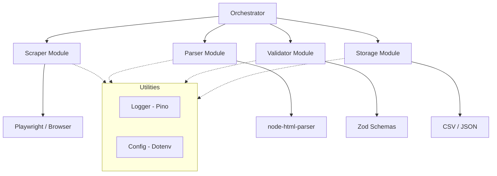

# 🌍 Google Maps Intelligence Scraper

[](https://nodejs.org/)
[](https://playwright.dev/)
[](https://jestjs.io/)
[](https://opensource.org/licenses/MIT)

A production-grade, modular search and data extraction engine for Google Maps. Designed for high performance, data integrity, and easy maintenance. Perfect for Lead Generation and Business Intelligence gathering.

---

## 🚀 Overview

The **Google Maps Intelligence Scraper** is a sophisticated CLI tool programmed to extract rich business intelligence from Google Maps listings. Built with a modular "Separation of Concerns" architecture, it handles everything from complex browser interactions to rigorous data validation and multi-format storage.

### Key Capabilities
- **Advanced Search & Scroll**: Intelligently handles infinite scrolling and results discovery.
- **Deep Data Extraction**: Captures Business Name, Address, Phone, Website, Ratings, and detailed Reviews.
- **Data Integrity**: Integrated validator module ensures structural correctness and removes duplicates using data fingerprinting.
- **Multi-Format Storage**: Exports cleanly to both JSON and CSV.
- **Robustness**: Built-in retry logic, CAPTCHA detection hints, and dynamic selector management.

---

## 🏗️ Architecture

The project follows a strict modular design to ensure scalability and ease of testing.



---

## 🛠️ Tech Stack

- **Runtime**: Node.js (v20+)
- **Automation**: Playwright (Chromium)
- **Parsing**: node-html-parser / JSDOM
- **Validation**: Zod
- **Testing**: Jest
- **Logging**: Pino / Pino-Pretty
- **Formatting**: Prettier + ESLint

---

## ⚙️ Setup & Installation

1. **Clone the Repository**
   ```bash
   git clone https://github.com/SaarthakBatra/google-maps-intelligence-scraper.git
   cd google-maps-intelligence-scraper
   ```

2. **Install Dependencies**
   ```bash
   npm install
   npx playwright install chromium
   ```

3. **Configure Environment**
   Create a `.env` file in the root:
   ```env
   DEFAULT_RATE_LIMIT=2
   DEFAULT_TIMEOUT=30000
   HEADLESS=true
   LOG_LEVEL=info
   ```

---

## 📋 Usage Guide

Run the scraper using the CLI interface:

```bash
# Basic search
node src/main.js --query "Coffee Shops" --location "Seattle, WA"

# Search with detailed extraction (visits every listing)
node src/main.js -q "Dentists" -l "Miami" --details --max=20

# Test run (no browser launch)
node src/main.js -q "Test" -l "Test" --dryRun
```

### CLI Arguments
| Flag | Description |
| :--- | :--- |
| `-q, --query` | The business type or keyword to search for. |
| `-l, --location` | The target geographic area. |
| `--max` | Limit the number of listings processed. |
| `--details` | Enable deep crawling for websites/phones/reviews. |
| `--dryRun` | Execute orchestration logic without scraping. |

---

## 🧪 Quality Assurance

We maintain high code quality standards through automated testing and linting.

```bash
# Run unit tests
npm test

# Check for linting issues
npm run lint

# Check formatting
npm run format:check
```

---

## 👤 Author

**Saarthak Batra**
- GitHub: [@SaarthakBatra](https://github.com/SaarthakBatra)
- Project: Google Maps Intelligence Scraper

---

## 📄 License

This project is licensed under the MIT License - see the [LICENSE](LICENSE) file for details.
